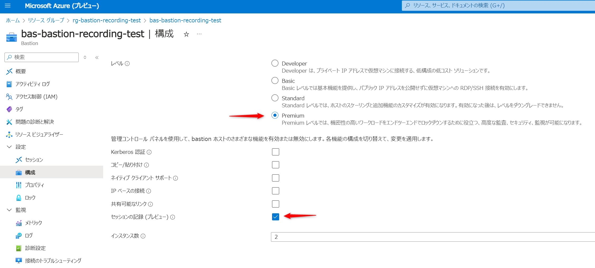

# Azure Bastion セッション リモートのお試し環境を構築する Terraform サンプル

このサンプルは、Azure Bastion のセッション リモートをお試しする環境を構築する Terraform 構成ファイルです。
Standard SKU の Bastion ホスト、リモートアクセス先の仮想マシン (Windows/Linux)、録画データを格納するためのストレージ アカウントを作成します。


## 使い方

本リポジトリをクローンして Terraform を実行してください。
仮想マシンにログインするためのパスワードを入力するように求められますので、12 文字以上のパスワードを入力してください。

```bash
$ terraform apply
var.admin_password
  Enter a value: 
```

Azure にリソースを作成できたら、Azure Portal プレビュー (https://preview.portal.azure.com/) から Bastion ホストの SKU を Standard から Premium にアップグレードします。
アップグレード時に「セッションの記録 (プレビュー)」を有効にしてください。



Bastion ホストからストレージアカウントに録画データを格納するための SAS URL を Terraform から取得して、Bastion ホストに登録します。

```bash
$ terraform output bastion_blob_sas_url
https://(snip)
```


Bastion ホストから仮想マシンに接続するとセッション レコーディングにより録画データがストレージ アカウントに格納されます。
Bastion ホスト上から再生して確認してください。
